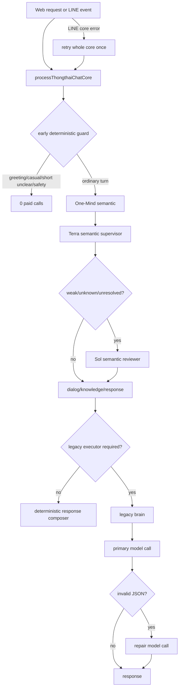

# Thongthai production AI paid-call audit

Checkpoint: `b40eb240e49e5a615dbd9f2c307ffe12d11281d8`
Branch: `human-brain/production-cost-guard`

## Customer runtime call graph (before cost guard)

## Paid boundaries found

| Boundary | File | Before-guard behavior | Risk |
|---|---|---|---|
| Semantic primary | `_semantic-interpreter.ts` -> `_thongthai-model-provider.ts` | Terra on every ordinary One-Mind turn | deterministic/context-safe turns still paid |
| Semantic review | `_semantic-interpreter.ts` | Sol after weak/unknown/unresolved primary | second paid semantic job on one turn |
| Legacy brain | `_thongthai-brain-v3.ts` | full Bible prompt through `callPreferredModel` | duplicate language/response work after One-Mind |
| Legacy repair | `_thongthai-brain-v3.ts` | repeats paid call when JSON is invalid | unbounded by conversation budget |
| Stay slot interpreter | `_thongthai-brain-v3.ts` | independent paid extraction | semantic work can be repeated |
| LINE transport retry | `_line-webhook-core.ts` | retries `processThongthaiChatCore` once | same event can pay twice |
| Response composer | `_response-composer.ts` | deterministic; no model/network call | already compliant |
| Certification scripts | `scripts/run-*-live-eval.ts` | explicit live calls | development-only; must never be enabled by customer input |

## Worst case before guard

A single ordinary turn can reach Terra + Sol + legacy primary + legacy repair. A LINE transport retry can repeat the core, yielding up to eight paid calls for one incoming event. A specialized stay extraction path can add another paid call. No pre-call conversation-cost reservation exists.

## Architecture mismatch vs regression vs missing capability

- Architecture mismatch: model-first orchestration ignores the existing deterministic candidate for safe turns.
- Real regression risk: LINE whole-core retry can repeat a successful semantic call.
- Missing capability: no canonical price calculator, persistent per-conversation ledger, pre-call reservation, or hard call limits.
- Preserved behavior: response composition is deterministic and transaction execution remains outside the semantic supervisor.

## Required target

- One authoritative paid semantic boundary.
- Production: 0 or 1 paid call per turn; no reviewer, no paid repair loop.
- Event-id idempotency across web and LINE.
- Persistent pre-call worst-case reservation under `$0.05` conversation cap.
- Explicit certification mode may force live calls, but customer requests cannot activate it.
